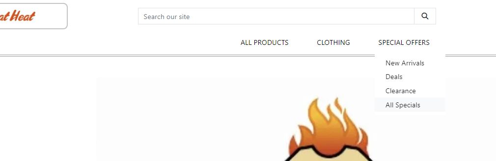
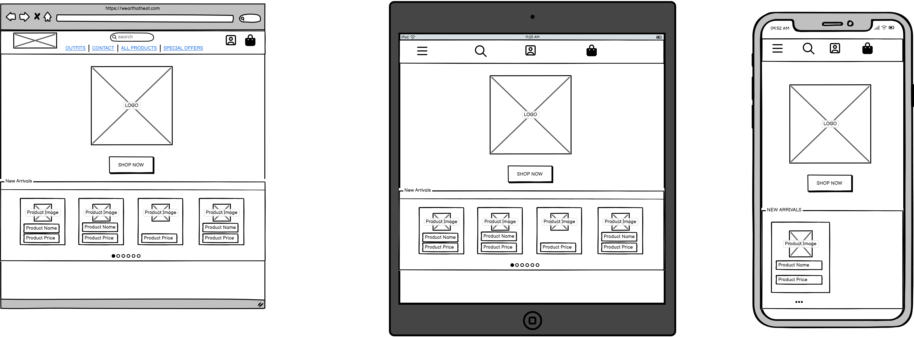

# WearThatHeat

Are you looking for a Swedish based marketplace where you can buy authentic cloths from a great variation of popular brands, [WearThatHeat](https://wear-that-heat-c81d8db45882.herokuapp.com/?page=1) is the place for you. In first sight you see all the new arrived products displayed on the homepage that you can with ease select and take a closer look to then decide if you would like to buy. Besides that, you as a user can browse between all the different clothing in one single tab. To make it easier for users to find the product they are looking for I have implemented several ways to sort products. For the purpose of finding something they know are in stock users can use the searchbar at the top, other sorting methods like price or a specific type of clothing exists aswell. WearThatHeat is even more friendly when it comes to administration, more info regarding that further down.

Incase you missed the link, visit WearThatHeat --> [HERE](https://wear-that-heat-c81d8db45882.herokuapp.com/?page=1)

## Features:

WearThatHeat has many cool features that provides a good UX. Down below I will show you a few of the user stories used and then screenshots on how they are implemented.
	
* Products
    * As a Shopper I can Easily see what I've searched for and the number of results so that Quickly decide wether the product I want is available
    

    * As a Shopper I can view individual products so that I can show information about the product I might buy
    
    

    * As a Shopper I can Quickly identify deals, clearance and special offers so that Take advantage of special savings on products i'd like to purchase
    
    
* User Authentication
    * As a Site user I can Easily register for an account so that Have a personal account and be able to view my profile
    

    * As a Site user I can Easily login and logout so that Access my   personal account informationj
    Log In: 
    Log Out: 
* Bag
    * As a Site user I can Show my bag so that decide which products I want to buy
    

    * As a Site user I can get notified when I add something to the bag so I in a user friendly way can verify that the product got added to the bag
    

* Checkout
    * As a Site user I can pay for the products so that I can get an order of the products I want
    
* Admin
    * As a Site admin I can Easily add new products so that I can update stock
    

    * As a Site admin I can Easily edit products so that I can edit stock
    

    * As a Site admin I can Easily delete products so that I can edit stock
    

More Features:

* Navbar
    

* Pagination
    

##  Features Left to Implement:
* News Letter - A cool feature to add would be to make it possible for the users to sign up for a news letter so that they can get updated each time the stock gets a major update.
* FAQ - A FAQ would be good since questions and misundestandings are very common. An FAQ would be a good way to handle them
* Swish - Swish is a Swedish payment system which is relativly easy to implement with API. This makes it very easy for users to pay from their phone. It is a wellknown app used in Sweden and very trustworthy.

## Technologies Used:

### Languages:

* HTML  
* CSS
* Python 
* JavaScript

### Frameworks and Softwear:

* Github
* Bootstrap
* Django
* Gitpod
* Balsamiq
* Heroku
* Google Chrome DevTools
* Cloudinary

## Validators:

* Python - Autopep8
    

* CSS - W3C
    

* HTML - W3C
    

* JavaScript - JSHint
    

## Design

Since WearThatHeat is a real life buisness with determined color scheem and logo I had a few things to build upon since start.

Here is a few WireFrames made with Balsamiq

* Home Page

    

* Products Page

    

* Bag Page

    

## Manual Testing:
* Using - I have used the site, tried every feature multiple times to make sure everything works as it should without problems.

* Friends and Family - I have asked friends and family to try it out aswell and asked for feedback. Functionality wise they found that categories was not displayed properly and that is now fixed. I have noticed that many times when you code, trying to make the site responsive and you use certain dimensions and on it looks good on your screen wont allways mean that it look that way on your phone. That is why I have asked friends and family to visit the site.

### Expected outcome: 
The site is responsive on phone and elements is not collapsing with each other or look off.

### Actual Outcome: 
The more screensizes we have tried the more issues have appeared. Ofcourse you could change all the styles as you see the issues, I think a more effective way is to have this in mind from the beggining, work more with percentage, mobile view first and decide which elements should be hidden on which dimensions and so on. I have handled the outcome of the testing as I first said, fixing the issues as they appeared since I have mainly worked with three different dimensions I thought this was the most effective way in comperhension to reworking all the style.

One way to test the style on your phone is making the workspace public and sending the link to your phone. That way can you see directly if the outcome is what you have expected.

### User Story Testing:
I have tested my user stories by putting myself in the perspective relevant to the story itself (User and Admin/Owner). Here are three examples:

* Register/SignUp: Testing this is prety straight forward. After creating the functionality I tried to register an account which worked. In order to make sure the functionality works proporly I visited the admin panel to control the account is saved in the data base.
* Product Detail: Once Product Detail page is created as described in the user story it's time to test wether it works proporly or not. The way I did this is clicking on products where they appear throughout the site and make sure Product Details page opens where it's suppose to without any errors.
* Create Outfit: After creating the functionality itself I went through a few steps when testing. Firstly I needed to make sure you could create the outfit in the data base via the admin panel, which worked well. The secound step was to make sure it was possible to create an outfit within the site itself without errors. This is also prety straight forward, after creating all the necessary pages the only thing left to do is create an outfit. Creating it worked well, it got saved in the data base. It was a probelm though, when displaying the outfits it sometimes caused the site to show a 500 error. After debuging I could see that Outfit was missing an argument (Image). This is because the Outfit class inherits from Product which requires an image. I fixed this by removing the requirement of an image from Outfit.

## Python testing
I have not done much automated testing. Alltho plenty of debugging has been done when things don't work as expected.

### Expected outcome: 
With one little change each time the expected outcome is mostly for the problem to be solved untill it is.

### Actual Outcome: 
Mostly the problem or error has been solved but sometimes, i. e Sending out confirmation Emails never worked, With help from resources Code Institute provides the outcome were that the emails gets printed in the console, not actually gets sent out to the user. When Debug is true you can see that is an SMTP error that missing a keyfile. After twisting and turning the code in plenty of ways together with Tutor Support and especially my mentor we concluded that the problem lies with the Versions of Django and python not working together and changeing/updating the other could cause more problem than it solves.

### Debugging
We have tried many things, changing emails, creating new app passwords, changes in the code TLS = False, linked the repository to a new app on heroku, compaired the code with other projects. We even uppdated to a later version of Django but once we did it seemed like more errors occured.

## Unfixed Bugs:
* Confirmation Emails - Since I used the same version of Django as in the walkthrough (Django > 4) Email functionality don’t seem to be supported. I spent hours trying to migrate/update the version of Django but because that resulted in new errors and problems I left it as an unfixed bug. I also contacted Student Care regarding this and did not get a clear answer on how to handle this. Might be worth mentioning that the code to accomplish this email functionality is there and the emails is getting logged in the terminal while in DEVELOPMENT.

This is also the reason why NewsLetter and confirmation emails for contact cannot be sent, when trying this functionality in development you can both see that the confirmation mail is sent in the console and it gets logged in the data base, not in the Deployed version because of this code snippet: 

* Emails Printed in Console:

* Validation Error - This error occures because of a duplication of an Id that generates with CrispyForms that I cannot affect
    

## Deployment: 

1. Once logged in on heroku, navigate to the dashboard.
2. Find the button that says "New", click that and then "Create new app".
3. Go to ElephantSQL and log in.
4. Click "Create New Instance".
5. Select  "Tiny Turtle (free)" and the Region as near you as possible.
6. Click "Review", "Create Instance" and return to the dashboard.
7. Open the instance and copy the url.
8. Install the plugins dj-database-url and psycopg2-binary in terminal and freeze requirements.txt.
9. add "web: gunicorn yourapp.wsgi:application" to your Procfile and migrate(python3 manage.py migrate).
10. Create a superuser to access Admin(python3 manage.py createsuperuser).
11. Load any .json files.
12. Install gunicorn and freeze.
13. Add the deployed url to you ALLOWED_HOSTS in settings.py.
14. When connected Heroku to GitHub, choose automatic deploys and deploy app.

## Business Model
WearThatHeat sells clothes to directly to people which makes it a buisnesss to consumer (B2C) Business Model. WearThatHeat sells relatively rare and pricey clothes which makes it hard to sell directly to businesses. This is why WearThatHeat's business model is B2C.

## Marketing Strategy

When it comes to Market Strategy, WearThatHeat has mainly focused on social media since that is where it all started, with a growing customer base, and entertaining posts the only thing left to implement is Search Engine Optimization (SEO). How that has been implemented can you read about below.

### SEO

* Topics and Keywords - I sat down and figuered out a couple of suitable Topics and then as many keywords I possibly could come up with and then removing the one's I thought were most popular in order to minimize the compition for them.
* Semantic Elements - I have tried to make as good use of semantic elements as I can, putting keywords in < strong > tags 
* Relevant links - In a section of the home page called "brands we sell", I have linked to brands that wearthatheat usually sells from.
* Name on images - Including the brand name in the images in combination with the name of the garment.
* Head element - in the Meta tags in the head element I have included keywords and a description that make use of a few of those keywords aswell.

### Social Media
* Facebook - I have created a Business Facebook for the website, since WearThatHeat exists in real life I didnt want to use that name for the facebook so that the owner could create one for himself without me removing this one.

* Instagram / TikTok - The founder of WearThatHeat is active on social media. Especially Instagram and Tiktok where he post updated stock, fun unboxing videos and so on. Unfortunately I do not have acces to those social media platforms but you can find the links to them below.

[WearThatHeat - Instagram](https://www.instagram.com/wearthatheat/)

[WearThatHeat - TikTok](https://www.tiktok.com/@wearthatheat)

## Credits

### Content

* Code Institute Walk through project Boutique ado
* Stack OverFlow
* A few youtube videos regarding django and e-commerce (No links available)
* Some style tricks from my instagram feed

### Images
* All the images, background, logo and all the product images are from my dear friend Wiktor who is the owner of WearThatHeat that also gave me permission to do this project in the way I did.

### A Great Thanks!

* My Mentor Antonio and Tutor support who got my back when I needed some extra guidance

## Other Info

* Pants, Shoes And Jackets - The pictures is taken from google with commercial license toggled on since the owner of WearThatHeat(Wiktor) did not provide me with that and I thought I needed at least one product of each category.

* Open AI - To generate product description I described the product for ChatGPT and asked for a suitable description.