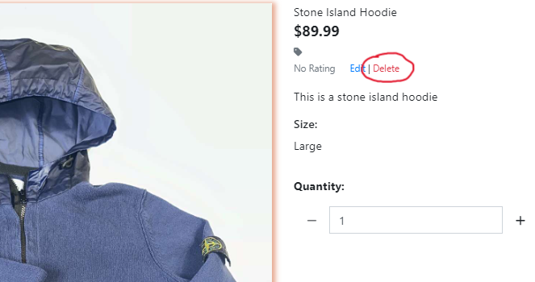

# WearThatHeat

Are you looking for a Swedish based marketplace where you can buy authentic cloths from a great variation of popular brands, WearThatHeat is the place for you. In first sight you see all the new arrived products displayed on the homepage that you can with ease select and take a closer look to then decide if you would like to buy. Besides that, you as a user can browse between all the different clothing in one single tab. To make it easier for users to find the product they are looking for I have implemented several ways to sort products. For the purpose of finding something they know are in stock users can use the searchbar at the top, other sorting methods like price or a specific type of clothing exists aswell. WearThatHeat is even more friendly when it comes to administration, more info regarding that further down.

## Features:

WearThatHeat has many cool features that provides a good UX. Down below I will show you a few of the user stories used and then screenshots on how they are implemented.
	
* Products
    * As a Shopper I can Easily see what I've searched for and the number of results so that Quickly decide wether the product I want is available
    

    * As a Shopper I can view individual products so that I can show information about the product I might buy
    
    

    * As a Shopper I can Quickly identify deals, clearance and special offers so that Take advantage of special savings on products i'd like to purchase
    
    
* User Authentication
    * As a Site user I can Easily register for an account so that Have a personal account and be able to view my profile
    

    * As a Site user I can Easily login and logout so that Access my   personal account informationj
    Log In: 
    Log Out: 
* Bag
    * As a Site user I can Show my bag so that decide which products I want to buy
    

    * As a Site user I can get notified when I add something to the bag so I in a user friendly way can verify that the product got added to the bag
    

* Checkout
    * As a Site user I can pay for the products so that I can get an order of the products I want
    
* Admin
    * As a Site admin I can Easily add new products so that I can update stock
    

    * As a Site admin I can Easily edit products so that I can edit stock
    

    * As a Site admin I can Easily delete products so that I can edit stock
    

More Features:

* Navbar
    

* Pagination
    

##  Features Left to Implement:
* News Letter - A cool feature to add would be to make it possible for the users to sign up for a news letter so that they can get updated each time the stock gets a major update.
* FAQ - A FAQ would be good since questions and misundestandings are very common. An FAQ would be a good way to handle them
* Swish - Swish is a Swedish payment system which is relativly easy to implement with API. This makes it very easy for users to pay from their phone. It is a wellknown app used in Sweden and very trustworthy.

## Technologies Used:

### Languages:

* HTML  
* CSS
* Python 
* JavaScript

### Frameworks and Softwear:

* Github
* Bootstrap
* Django
* Gitpod
* Balsamiq
* Heroku
* Google Chrome DevTools
* Cloudinary

## Validators:

* Python - Autopep8
    

* CSS - W3C
    

* HTML - W3C
    

* JavaScript - JSHint
    

## Manual Testing:
* Using - I have used the site, tried every feature multiple times to make sure everything works as it should without problems.

* Friends and Family - I have asked friends and family to try it out aswell and asked for feedback. Functionality wise they found that categories was not displayed properly and that is now fixed.

## Unfixed Bugs:
* Confirmation Emails - Since I used the same version of Django as in the walkthrough (Django > 4) Email functionality don’t seem to be supported. I spent hours trying to migrate/update the version of Django but because that resulted in new errors and problems I left it as an unfixed bug. I also contacted Student Care regarding this and did not get a clear answer on how to handle this. Might be worth mentioning that the code to accomplish this email functionality is there and the emails is getting logged in the terminal while in DEVELOPMENT.

* Validation Error - This error occures because of a duplication of an Id that generates with CrispyForms that I cannot affect
    

## Deployment: 

Sign up or log in to Heroku. On the dashboard, click "New" and choose "Create new app." Give it a unique name, pick the closest region, then click "Create app."

For a Heroku-accessible database, sign up or log in to ElephantSQL. Click "Create New Instance," set up the "Tiny Turtle (free)" plan with a name, select a nearby region, and click "Review" and then "Create instance."

Copy the database URL from the ElephantSQL dashboard under your project's instance name.

In the terminal, install dj-database-url and psycopg2-binary. Run "pip3 freeze > requirements.txt" to update the requirements file.

Create a Procfile in the root directory with "web: gunicorn yourapp.wsgi:application."

Migrate the database structure to ElephantSQL: "python manage.py migrate."

Create a superuser with "python3 manage.py createsuperuser."

Load .json files for categories and items.

Install gunicorn with "pip install gunicorn" and add it to requirements.txt: "pip3 freeze > requirements.txt."

Add Heroku app and localhost to ALLOWED_HOSTS: "ALLOWED_HOSTS = ['HEROKU_APP_NAME.herokuapp.com', 'localhost']."

Connect Heroku to GitHub for automatic deploys.

Deploy the app and access the website.

## Credits
